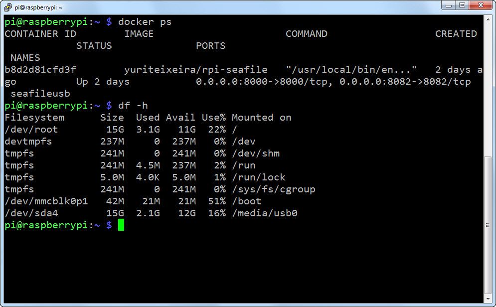
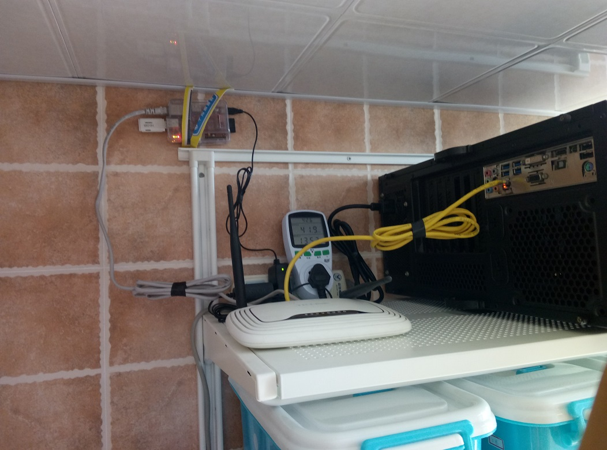

  折腾到凌晨

之前在树莓派上面试过owncloud，同步比较慢还容易报错。搜索了下类似的软件，发现seafile，一个非常不错的私有云平台。
面临两个问题：
1. 树莓派系统曾经挂过两次，SD卡完全无法启动。到目前为止稳定运行了好几个月，没有能重现。不过害怕数据丢失。数据肯定不能存在SD卡里面了。
2. 爱折腾，所以树莓派系统不会一直保持不变。需要让数据、应用和系统解耦，使得在重装系统的情况下可以快速部署和恢复seafile的服务。

解决问题1，为树莓派挂载了个16G的U盘，期间出了点小插曲。树莓派对于vFAT格式支持不好，很多命令无法运行。所以将U盘格式化为ext4格式，直接挂载使用。

解决问题2，使用docker，在树莓派上安装docker环境，在docker hub中搜索rpi－seafile。 

成功运行。。
  

